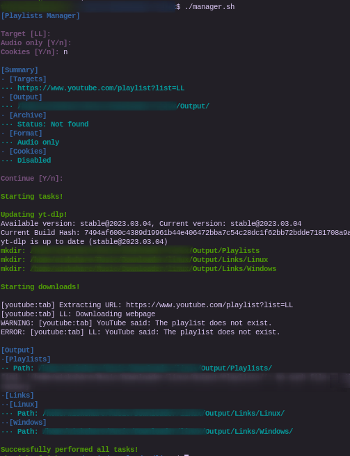

<h1 align="center">Playlists Manager</h1>

    

Linux and Windows console scripts that wrap the yt-dlp binary to manage playlists

<h2 align="center">Description</h2>

Linux and Windows console scripts that wrap the yt-dlp binary to manage playlists, scan playlist for urls, drag&drop to download, etc. Linux and Windows versions are diferent in some fields. It comes with a linux.sh bash file that automates the set up of the Linux version, uncompressing some libraries and moving them. It also comes with it Windows counterpart windows.bat that does the same for the Windows version.

<h2 align="center">Screenshots</h2>

<!---->

<h2 align="center">Dependencies</h2>

It only depends on the unzip binary to run the linux.sh on Linux

<h2 align="center">Installation</h2>

Run the linux.sh or windows.bat file depending on your system.

<h2 align="center">Authors</h2>

    </img>

<h4 align="center">TheWisker</h4>

    </img>

<h4 align="center">alex-bia</h4>
