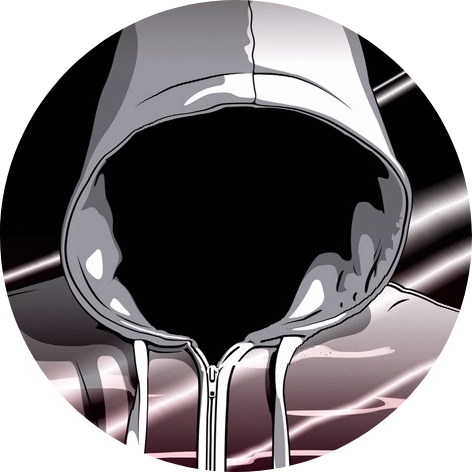

<h1 align="center">Playlists Manager</h1>

    

Linux and Windows console scripts that wrap the yt-dlp binary to manage playlists

<h2 align="center">Description</h2>

Linux and Windows console scripts that wrap the yt-dlp binary to manage playlists, scan playlists for urls, drag&drop to download, etc. Linux and Windows versions are diferent in some fields.

<h2 align="center">Structure</h2>

<h3>Linux</h2>

- linux.sh: Sets up the project for self-contained use in **Linux**.
    - Use as `linux.sh noconfirm` to avoid confirmation prompt.
- install.sh: Sets up the project for normal use in **Linux**.
    - Use as `install.sh noconfirm` to avoid confirmation prompt.

- manager.sh: Manages the download and update of youtube playlists using yt-dlp.
    - Call with `out` env variable set to the desired output directory or the *manager.sh* residing directory will be used.
    - Call with `audio` env variable set to **Y** for audio output or anything else for video. Alternatively, if not set, the program will prompt.
    - Call with `cookies` env variable set to **Y** to use *cookies.txt* in the *manager.sh* residing directory or anything else to not use cookies. Alternatively, if not set, the program will prompt.

- scanner.sh: Manages the download and update of youtube playlists links using yt-dlp.
    - Call with `out` env variable set to the desired output directory or the *scanner.sh* residing directory will be used.
    - Call with `cookies` env variable set to **Y** to use *cookies.txt* in the *scanner.sh* residing directory or anything else to not use cookies. Alternatively, if not set, the program will prompt.

<h3>Windows</h2>

- windows.bat: Sets up the project for self-contained use in **Windows**.

- yt-download-from-shorcuts.bat: Downloads a video from a youtube shorcut or shorcuts.
    - Call with `-a` for audio output and with `-v` for video output.
    - Then append the list of shorcuts to process.
 
- shorcut-maker.bat: Creates a shorcut.

<h2 align="center">Screenshots</h2>

    

<!---->

<h2 align="center">Dependencies</h2>

To run the <i>linux.sh</i> on Linux the <b>unzip</b> binary is needed

<h2 align="center">Installation</h2>

Run the <i>linux.sh</i>, <i>install.sh</i> or <i>windows.bat</i> file depending on your system and situation.

<h2 align="center">Authors</h2>

    </img>
    </img>

    <h4 align="center"><pre>TheWisker                   alex-bia</pre></h4>

